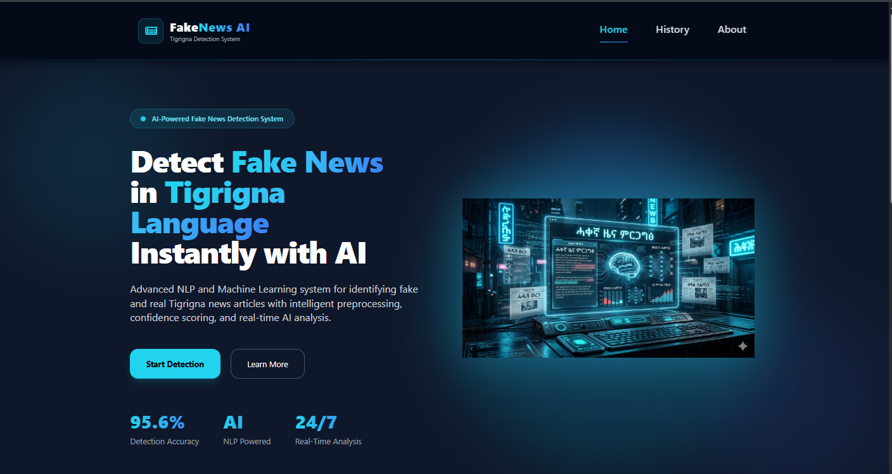
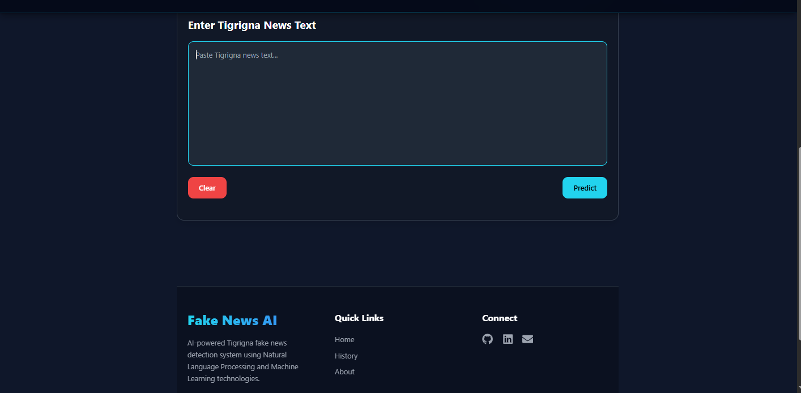
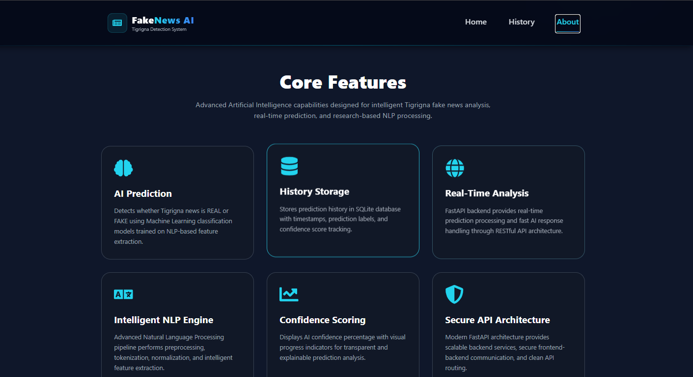

# Tigrigna Fake News Detection System


## Overview

The Tigrigna Fake News Detection System is a full-stack AI-powered web application developed to classify Tigrigna news content as either **REAL** or **FAKE** using Natural Language Processing (NLP) and Machine Learning techniques.

The project was developed as a final-year Computer Science and Engineering project with the goal of addressing misinformation challenges in low-resource languages such as Tigrigna.

The system integrates a React frontend, FastAPI backend, and machine learning models to provide real-time fake news prediction and analysis.

---

## Key Features

* Real-time fake news prediction
* Machine learning-based text classification
* Confidence score analysis
* Risk-level indication
* Prediction history management
* Responsive frontend interface
* REST API integration using FastAPI
* SQLite database integration
* Full-stack cloud deployment
=======
<p align="center">
  <b>
    An AI-powered full-stack web application for detecting fake news in the
    Tigrigna language using Natural Language Processing (NLP) and Machine Learning.
  </b>
</p>

---

# 📌 Project Overview

The **Tigrigna Fake News Detection System** is a full-stack intelligent web application developed to automatically classify Tigrigna news content as either:

- ✅ REAL
- ❌ FAKE

using **Natural Language Processing (NLP)** and **Machine Learning** techniques.

The project was developed as a **final-year Computer Science and Engineering team project** to help combat misinformation in low-resource languages such as **Tigrigna**.

---

## Technologies Used


### Frontend

* React.js
* Vite
* Axios
* CSS

### Backend

* FastAPI
* Uvicorn
* SQLAlchemy
* Pydantic
* SQLite

### Machine Learning & NLP

* Scikit-learn
* Pandas
* NumPy
* Joblib
=======
- 📰 Real-time fake news prediction
- 🤖 AI-powered text classification
- 📊 Confidence score analysis
- ⚠️ Risk-level indication
- 🕒 Prediction history management
- 🎨 Modern responsive React UI
- ⚡ FastAPI backend API
- ☁️ Full-stack deployment

---

# 📸 Application Screenshots

## 🖥 Main User Interface

<p align="center">
  
</p>

---

## 📊 Prediction Area

<p align="center">
  
</p>

---

## ℹ️ About Page

<p align="center">
  
</p>


---

## NLP Pipeline


The NLP preprocessing workflow includes:

* Text cleaning
* Text normalization
* Tokenization
* Stopword removal
* TF-IDF vectorization
=======
## 🎨 Frontend

- React.js
- Vite
- Axios
- CSS

---

## ⚙️ Backend

- FastAPI
- Uvicorn
- SQLAlchemy
- SQLite

---

## 🤖 Machine Learning & NLP

- Scikit-learn
- Pandas
- NumPy
- Joblib

---

# 🔍 NLP Pipeline

- Text cleaning
- Normalization
- Tokenization
- Stopword removal
- TF-IDF vectorization

---

# 🤖 Machine Learning Models Tested

- Naive Bayes
- Logistic Regression
- Support Vector Machine (SVM)

✅ Final selected model: **SVM**
 

---

## Machine Learning Models Evaluated


Several machine learning models were tested during experimentation:

* Naive Bayes
* Logistic Regression
* Support Vector Machine (SVM)

The final system uses the SVM model due to its strong classification performance on the dataset.

=======
| Metric | Result |
|---|---|
| Accuracy | ~96% |
| Precision | High |
| Recall | High |
| F1-Score | High |


---

## Model Performance

| Metric             | Result |
| ------------------ | ------ |
| Accuracy           | ~96%   |
| Model Type         | SVM    |
| Feature Extraction | TF-IDF |

Evaluation techniques included:

* Cross-validation
* Confusion matrix
* Classification report

---

## System Architecture

```text
Frontend (React + Vite)
        ↓
Axios API Requests
        ↓
FastAPI Backend
        ↓
NLP Preprocessing
        ↓
TF-IDF Vectorization
        ↓
SVM Model Prediction

        ↓
Prediction Result
        ↓
=======
            ↓
Prediction Result
            ↓

SQLite Database Storage
```

---


## Installation

### Clone the repository

```bash
git clone https://github.com/kikikatg/tigrigna_fake_news_detection_using_NLP.git
```

### Navigate into the project directory

```bash
cd tigrigna_fake_news_detection_using_NLP
```

### Install frontend dependencies

```bash
npm install
```

### Install backend dependencies

```bash
pip install -r requirements.txt
```

### Start frontend

```bash
npm run dev
```

### Start backend

```bash
uvicorn main:app --reload
=======
# 📂 Project Structure

```text
tigrigna_fake_news_detection_using_NLP/
│
├── frontend/
├── backend/
├── screenshots/
│   ├── fake_news_detection_UI.png
│   ├── prediction_area.png
│   └── about-page.png
│
└── README.md

```

---


## Live Deployment

### Frontend Application

https://tigrigna-fake-news-detection-using.vercel.app/

### Backend API

https://tigrigna-fake-news-detection-using-nlp-1.onrender.com

### Telegram Bot

https://t.me/tigrigna_fake_news_detector_bot
=======
# ⚙️ Installation

## Clone Repository

```bash
git clone https://github.com/kikikatg/tigrigna_fake_news_detection_using_NLP.git
```

---

## Frontend Setup

```bash
cd frontend
npm install
npm run dev
```

---

## Backend Setup

```bash
cd backend
pip install -r requirements.txt
uvicorn main:app --reload
```

---

# 🌐 Live Deployment

## 🚀 Frontend

👉 https://tigrigna-fake-news-detection-using.vercel.app/

---

## ⚡ Backend API

👉 https://tigrigna-fake-news-detection-using-nlp-1.onrender.com


---

## Future Improvements


* Deep learning model integration
* Improved dataset expansion
* Enhanced multilingual support
* Explainable AI prediction analysis
* User authentication system

---

## Author

Kiros Asefa Tesfay

* GitHub: https://github.com/kikikatg
* LinkedIn: https://www.linkedin.com/in/kiros-asefa/

---
=======
👉 https://t.me/tigrigna_fake_news_detector_bot

---

# 👨‍💻 Author

## Kiros Asefa

🎓 Computer Science & Engineering Student  
💻 Full-Stack Developer & AI Enthusiast

---

# 🌐 Connect With Me

- GitHub: https://github.com/kikikatg
- LinkedIn: https://www.linkedin.com/in/kiros-asefa/

---

<p align="center">
  🚀 Built with passion, research, and real-world AI problem solving
</p>

